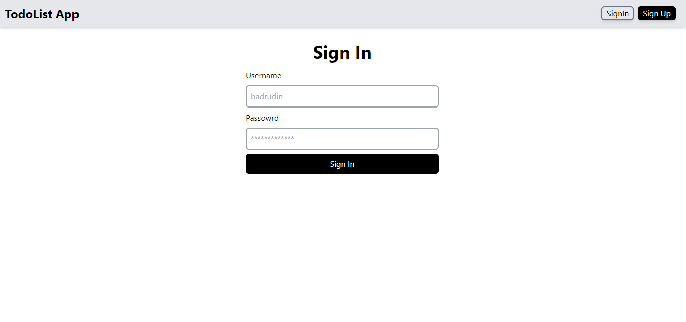
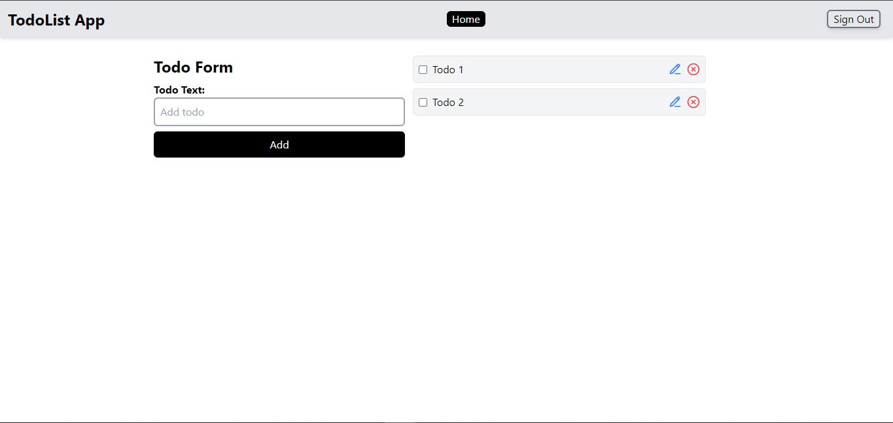

# React & Firebase Todo App


A simple and intuitive Todo application built with React for the frontend and Firebase for the backend. This project demonstrates how to create, read, mark as complete and delete on a todo list using Firebase Firestore. It also includes user authentication to ensure that each user's todos are private.

## Features

- **User Authentication**: Sign up and login using Firebase Authentication.
- **CRUD Operations**: Add, mark as complete, and delete todos.
- **Responsive Design**: Works on both desktop and mobile devices.
- **Firebase Hosting**: Hosted on Firebase for seamless deployment and access.

## Technologies Used

- **React**: A JavaScript library for building user interfaces.
- **Firebase**:
  - **Authentication**: For user sign-up and login.
  - **Firestore**: For storing and managing todos.
  - **Hosting**: For deploying the application.
- **React Router**: For navigation between different pages.
- **React Toastify**: For user-friendly notifications.
- **Tailwind CSS**: For styling the application.


## Screenshots


## Sign In Screen



## Sign Up Page


## Home Page




## Demo

Check out the live demo of the app here: [Live Demo](https://test-fe4d7.web.app/)


## Getting Started

Follow these instructions to set up the project locally.

### Prerequisites

- Node.js and npm installed
- Firebase account

### Installation

1. **Clone the repository**:
   ```bash
   git clone https://github.com/Badrudin-cloud/react-and-firebase-todo-app.git
   cd react-and-firebase-todo-app
